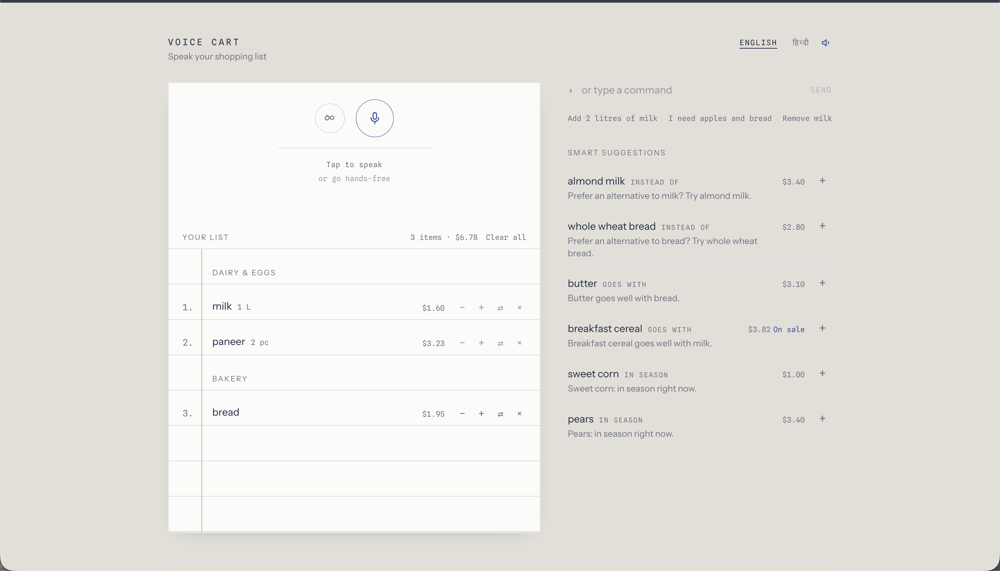

# Voice Cart — Voice Command Shopping Assistant

### ▶ [voice-shop-list.vercel.app](https://voice-shop-list.vercel.app/)

Build a shopping list by *talking* to it, in **English or Hindi**. Voice Cart understands
natural phrasing ("I need two litres of milk"), categorises items automatically, remembers
what you buy, and answers voice-driven product searches ("find toothpaste under $5").



**Stack:** Next.js 16 (App Router) · React 19 · TypeScript · Tailwind CSS 4 · Whisper large-v3 (Groq)

> Allow microphone access when the browser asks. Tap the mic and speak, or switch on
> hands-free (`∞`) and just talk. Everything also works by typing, if you would rather read
> than speak.

---

## Setup

Speech recognition uses **Whisper large-v3** hosted on Groq, so you need one free API key:

1. Create a key at [console.groq.com/keys](https://console.groq.com/keys).
2. `cp .env.example .env.local` and paste the key into `GROQ_API_KEY`.
3. `npm install && npm run dev`.

Deploying: add `GROQ_API_KEY` as an environment variable on the host. It is read only
inside the route handler and carries no `NEXT_PUBLIC_` prefix, so it never reaches the
browser bundle. On Vercel, set it for Preview as well as Production, or previews will
report that recognition is not configured while production works.

Without the key the app still runs — the list, suggestions, search and the text command
bar all work — but the microphone will report that recognition is not configured.

---

## How it is put together

Two deliberately different halves:

- **Recognition is a hosted model.** Whisper large-v3 handles accents, Hinglish
  code-switching and noisy rooms far better than the browser's built-in recogniser, and
  it is prompted with this app's own vocabulary (grocery nouns and command verbs) to
  sharpen recall further.
- **Understanding is local and deterministic.** Once there is a transcript, intent
  parsing is a **rule-based NLP pipeline** written from scratch — no LLM in the loop.
  That keeps interpretation free, instant, and covered by **115 unit tests**.

---

## Features

### 1. Voice input
- **Whisper large-v3** transcription via Groq, prompted with the app's own grocery
  vocabulary so terms like *atta*, *besan* and *shimla mirch* come back correctly.
- **Hands-free voice activation** (`∞`), sitting right beside the mic. Activating
  either control collapses the other, so whichever mode is running always has one
  obvious off switch. An audio-thread worklet watches the input level against an
  adaptive noise floor: speech opens a clip, a short silence closes it and sends it
  for transcription. No tapping, no wake word. It releases the mic after 60 seconds
  of silence, and keeps listening across tab switches — detection runs on the audio
  thread precisely because `requestAnimationFrame` is suspended in a hidden tab.
- **Barge-in protection** — the microphone is muted while the assistant is speaking,
  plus a short grace period afterwards, so it never transcribes its own voice.
- **Push-to-talk** as the alternative: tap once, speak, and stop. It closes on its
  own when you pause — no second tap — and gives up after eight seconds of silence.
  The mic is released once the clip is transcribed, so the browser's recording
  indicator does not stay lit.
- **Natural language understanding** — all of these mean the same thing:
  `Add milk` · `I need milk` · `I want to buy milk` · `grab some milk` · `milk`
- **Multilingual**: English and Hindi. Hindi is understood in Devanagari
  (`दूध जोड़ो`) *and* in romanised Hinglish (`do kilo chawal chahiye`). The whole UI,
  the spoken replies and the suggestion copy switch language too. Hindi verbs are
  matched whether the transcript joins or splits them (`हटा दो` / `हटादो`) and across
  conjugations, and Devanagari nouns fall back to a **consonant-skeleton** match,
  because Indic transcription errors land on the vowel signs rather than the
  consonants — `अंदि` still resolves to `अंडे`.
- **Spoken replies** via speech synthesis, with quality-ranked voice selection.
- Keyboard shortcut: press <kbd>M</kbd> to toggle the microphone.

### 2. Smart suggestions
Four independent signals, blended and ranked, then *diversified* so no single signal
floods the rail:

| Signal | Example |
| --- | --- |
| **Repurchase history** | "Looks like you're running low on bread — last added 10 days ago." |
| **Seasonal** | "Carrots: in season right now." |
| **Substitutes** | "Prefer an alternative to milk? Try almond milk." |
| **Complements** | "Pasta sauce goes well with pasta." |

**Proactive prompts.** In hands-free mode, ten seconds of silence makes the assistant
offer something out loud — "You usually buy milk. Want it on the list?" — drawn by
*weighted* random choice, so an item you buy nine times is far likelier than one you
bought once but never certain. A purely ranked pick suggested the same thing every
session, which reads as broken rather than smart. Answer by voice (`yes` / `नहीं`) or by
tapping the card. It never repeats an offer and stops after four prompts a session.

Cadence is *learned*: if you actually buy rice every 4 days, that beats the catalog's
30-day default. Items already on the list are never suggested.

### 3. Shopping list management
- Add / remove / update by voice — `Remove milk from my list`, `change milk to 3`,
  `I bought the eggs` (bought means done, so it comes off the list), `clear my list`.
- **Automatic categorisation** into 12 supermarket aisles, sorted in walking order.
- **Quantities and units** — `Add 2 bottles of water`, `Buy 5 oranges`, `add 500g paneer`,
  `दो लीटर दूध`. Only a unit you actually say is kept; everything else counts in pieces,
  so `add toothpaste` reads as one toothpaste rather than "1 g toothpaste". Repeat
  additions merge (`2 bottles` + `3 bottles` = `5 bottles`).
- **Compound instructions** — `remove paneer and add tofu` is two commands in one
  breath, applied in order with a single reply and a single undo. Word order is
  respected: English breaks before each verb, Hindi after it (`पनीर हटाओ और टोफू जोड़ो`).
- **Multi-item utterances** — `add bread and butter and 6 eggs` adds three items, and
  several products named inside one clause are split apart too, so
  `1 kg apples and 1 kg bananas along with 1 kg coriander` yields all three with their
  own quantities.
- Single-step **undo**, running **cost estimate** (quantity only multiplies when the
  spoken unit matches the catalog unit, so six eggs are not billed as six dozen), and
  per-item **substitute swap**.
- The list is saved to `localStorage`, so it survives a refresh.

### 4. Voice-activated search
- `Find organic apples` · `Find toothpaste under $5` · `show me juice between $2 and $4` ·
  `find Colgate toothpaste` · `टूथपेस्ट ढूंढो`
- Filters extracted from speech: **price ceiling / floor / range, brand, organic, size**.
- Served by a real endpoint (`POST /api/search`) with an automatic client-side fallback
  if the request fails, so search still works offline.

### 5. UI/UX
The interface is a **sheet of ruled paper on a desk**. Items sit *on* the printed
rules, quantities are written in the margin past the red margin line, and the
signature gesture is a pen stroke: the live microphone level draws as an ink line
travelling along a rule, and checking an item off strikes it through with the same
stroke. Two typefaces only — Instrument Sans for item names, Spline Sans Mono for
quantities, prices and labels, because a tally really is monospace — with Noto Sans
Devanagari so Hindi sets properly. Everything the assistant offers stays off the
paper, quiet, on the desk beside it.

- Minimalist, mobile-first, single-column on phones and two-column on desktop.
- **Real-time visual feedback** for every recognised command, colour-coded by outcome.
- Loading skeletons while the saved list hydrates and while a search is in flight.
- Saying **"help"** opens an on-screen command reference grouped by task, with every
  example runnable by tap — a spoken one-liner is too easy to miss.
- Full keyboard access and ARIA live regions for screen readers.
- Graceful degradation: browsers without the Speech API get a clear message and a
  **text command bar** that runs the exact same parser.

---

## Voice command reference

| Intent | English | Hindi |
| --- | --- | --- |
| Add | "add two litres of milk" | "दो लीटर दूध जोड़ो" |
| Add (natural) | "I need apples and bread" | "मुझे सेब और ब्रेड चाहिए" |
| Remove | "remove milk from my list" | "दूध हटा दो" |
| Update quantity | "change milk to 3" | "दूध तीन कर दो" |
| Bought (removes it) | "I bought the eggs" | "अंडे खरीद लिए" |
| Clear | "clear my list" | "पूरी लिस्ट हटाओ" |
| Read back | "what's on my list" | "लिस्ट में क्या है" |
| Search | "find toothpaste under $5" | "टूथपेस्ट ढूंढो" |
| Help | "help" · "what can you do" | "मदद" · "क्या कर सकते हो" |

---

## Getting started

```bash
npm install
npm run dev          # http://localhost:3000
```

```bash
npm test             # 115 unit tests (Vitest)
npm run typecheck    # tsc --noEmit
npm run lint         # eslint
npm run build        # production build
```

> **Browser support:** recognition needs `MediaRecorder` and `getUserMedia`, which
> Chrome, Edge, Firefox and Safari 14.1+ all provide. Voice input requires HTTPS
> (or localhost) and microphone permission; browsers without audio capture fall back
> to the text command bar.

---

## Architecture

```
src/
├─ app/
│  ├─ page.tsx                  Orchestrates capture ⇄ parser ⇄ reducer ⇄ UI
│  ├─ layout.tsx                Metadata, fonts, theme colours
│  └─ api/
│     ├─ search/route.ts        POST/GET catalog search endpoint
│     └─ transcribe/route.ts    Whisper large-v3 on Groq
├─ components/              MicButton, IdleNudge, ShoppingList, SuggestionRail, …
├─ hooks/
│  ├─ useVoiceCapture.ts        Mic capture, voice-activity detection, transcription
│  └─ useSpeechSynthesis.ts     Spoken replies with quality-ranked voice selection
└─ lib/
   ├─ nlp/
   │  ├─ normalize.ts       Unicode/punctuation folding, singulariser, edit distance
   │  ├─ lexicon.ts         Numbers, units, intent patterns, fillers (en + hi)
   │  ├─ match.ts           Longest-alias n-gram matcher with fuzzy fallback
   │  └─ parser.ts          transcript → { intent, items, filters, confidence }
   ├─ catalog.ts            ~150 products: aliases, prices, seasons, substitutes
   ├─ suggestions.ts        Four-signal recommender with kind diversification
   ├─ search.ts             Ranking + price/brand/organic filtering
   ├─ store.ts              Pure reducer: commands → list mutations + replies
   └─ i18n.ts               UI strings and example commands per language
```

### How a command flows

```
"मुझे दो किलो चावल और प्याज चाहिए"
   → normalize        strip punctuation, fold case, detect Devanagari → lang = hi
   → detectIntent     matches "चाहिए" → add; strips every command verb
   → split            on "और" → ["मुझे दो किलो चावल", "प्याज"]
   → per segment      quantity 2 + unit किलो → kg; fillers dropped; alias → rice / onion
   → reducer          merges into the list, records history, builds a bilingual reply
   → UI + TTS         banner, list row, spoken confirmation
```

### Design decisions worth calling out

- **The parser is pure and synchronous.** No network, no state — which is what makes
  64 tests cheap to write and the app instant to respond.
- **Intent patterns are ordered by specificity**, and every command verb is stripped
  before item lookup. That is why `दूध हटा दो` removes milk instead of adding "2 milk"
  (the Hindi verb tail `दो` also means "two").
- **Unknown words are only added when a command verb is present.** Saying `add jackfruit`
  creates a free-text item; mumbling `asdkjh` asks you to try again rather than
  polluting the list.
- **Fuzzy matching is bounded** (Levenshtein ≤ 2, length-gated) so `tomatos` → tomato and
  `shampu` → shampoo without wild mismatches.
- **Client state lives in one reducer**, so voice commands and taps take identical paths
  and undo is a single snapshot.

---

## API

```bash
curl "https://voice-shop-list.vercel.app/api/search?q=toothpaste&maxPrice=5"

curl -X POST https://voice-shop-list.vercel.app/api/search \
  -H 'Content-Type: application/json' \
  -d '{"filters":{"query":"apples","organicOnly":true},"limit":5}'
```

Response: `{ filters, results: [{ product, price, matchedBrand? }] }`

---

## Known limitations

- Prices and the product catalog are curated static data, not a live retailer feed.
- Speech recognition quality depends on the browser and the user's accent; Hindi
  recognition needs a Hindi voice pack on some platforms.
- History and the list are per-browser (`localStorage`) — there are no accounts.
- The parser covers the command grammar in the table above; free-form conversation
  ("what should I cook tonight?") is out of scope by design.

## Licence

MIT
